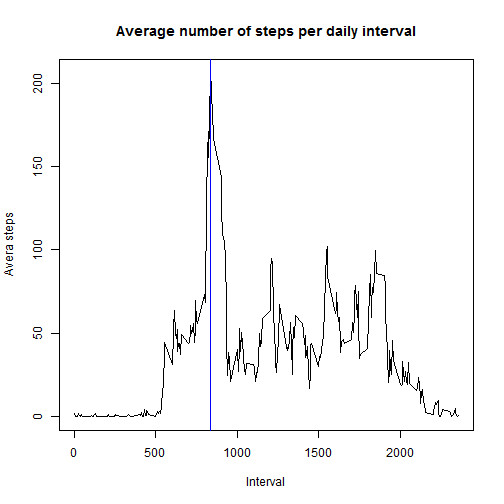

  
## Loading and preprocessing the data

```r
url <- "http://d396qusza40orc.cloudfront.net/repdata%2Fdata%2Factivity.zip"
download.file(url, "repdata-data-activity.zip", mode = "wb")
unzip("repdata-data-activity.zip")
data <- read.csv("activity.csv")
data$date <- as.Date(data$date)
```
  
## What is mean total number of steps taken per day?

```r
daily.steps <- tapply(data$steps, data$date, sum)
barplot(daily.steps, main = "Total nuber of steps per day", xlab = "Date", ylab = "Total number of steps")
```

 

```r
mean <- mean(daily.steps, na.rm = TRUE)
mean.string <- as.character(round(mean, digits = 2))
median <- median(daily.steps, na.rm = TRUE)
```
The average number of steps taken per day is 10766.19 and the median is 10765.  
  
## What is the average daily activity pattern?

```r
int.steps <- tapply(data$steps, data$interval, mean, na.rm = TRUE)
plot(as.numeric(names(int.steps)), int.steps, type = 'l', main = "Average number of steps per daily interval", xlab = "Interval", ylab = "Avera steps")
```

 

```r
max <- max(int.steps)
max.string <- as.character(round(max, digits = 2))
int <- names(int.steps[which(int.steps == max)])
```
The daily observations show a peak around the interval 835 with a maximum of 206.17 average number of steps.  
  
## Imputing missing values

```r
NA.count <- sum(is.na(data$steps))
data.adj <- data
```
The number of missing data is 2304.  
It was noted that the missing data are not scattered across the data set but are all concentrated in the days having not bar in the first bar-plot. The strategy adopted is to find these days and replace all missing data with the average number of steps of the interval they belonged to.

```r
# Missing data are not scattered but concentrated in few days
for (i in 1: length(daily.steps)) {
    if (is.na(daily.steps[i])) {
        # For the i-th day substitute all NAs with the average value of the interval
        data.adj$steps[data.adj$date == names(daily.steps)[i]] <- int.steps
    }
}
daily.steps.adj <- tapply(data.adj$steps, data.adj$date, sum)
barplot(daily.steps.adj, main = "Total nuber of steps per day", xlab = "Date", ylab = "Total number of steps")
```

 

```r
mean.adj <- mean(daily.steps.adj)
mean.adj.string <- as.character(round(mean.adj, digits = 2))
median.adj <- median(daily.steps.adj)
median.adj.string <- as.character(round(median.adj, digits = 2))
```
The new average number of steps per day is 10766.19 and the new median is 10766.19. The mean has not changed, as we expected. The median has suffered a small increase because missing values were replaced with averages in decimal format, whereas steps are in units. The new median falls on one of the days ahving missing data and is equal by construction to the mean.
  
## Are there differences in activity patterns between weekdays and weekends?

```r
data.adj$week <- weekdays(data.adj$date)
data.adj$week[data.adj$week == "Saturday" | data.adj$week == "Sunday"] <- "weekend"
data.adj$week[data.adj$week != "weekend"] <- "weekday"
int.steps2 <- data.frame(with(data.adj, tapply(steps, list(interval, week), mean)))
with(int.steps2, {
    par(mfrow = c(2, 1))
    plot(rownames(int.steps2), int.steps2[, 1], type = "l", main = colnames(int.steps2)[1], xlab = "Interval", ylab = "Number of teps")
    plot(rownames(int.steps2), int.steps2[, 2], type = "l", main = colnames(int.steps2)[2], xlab = "Interval", ylab = "Number of teps")
})
```

 
